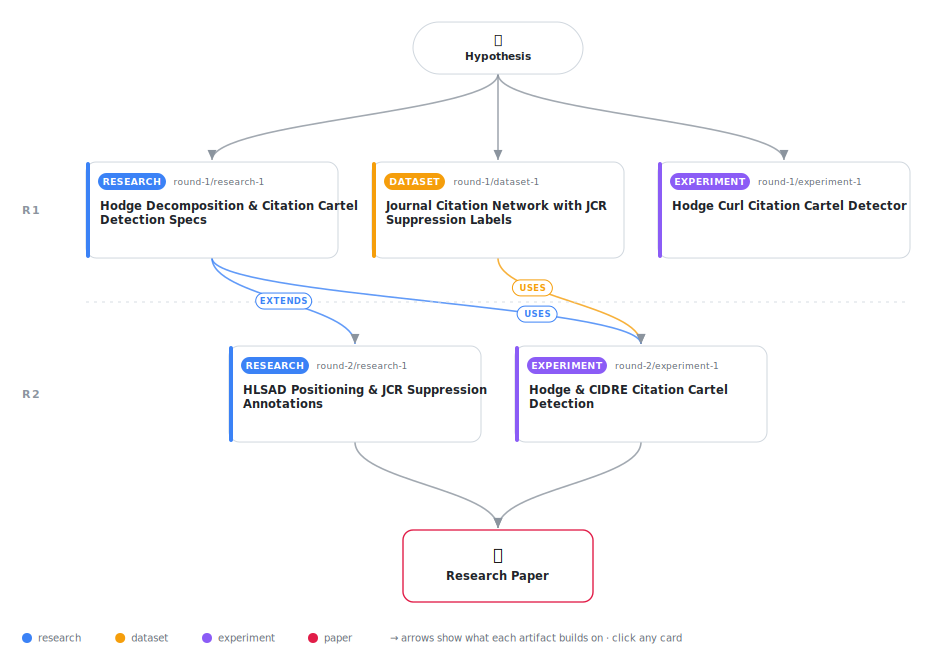

# Curl in the Citation Graph: Hodge Flow Decomposition Detects Citation Cartels via Field-Aware Calibration

<div align="center">

<a href="https://cdn.jsdelivr.net/gh/AMGrobelnik/ai-invention-d509fc-curl-in-the-citation-graph-hodge-flow-de@main/workflow.svg">
<picture>
  <source media="(prefers-color-scheme: dark)" srcset="workflow-dark.svg">
  
</picture>
</a>

<sub>🖱️ <b><a href="https://cdn.jsdelivr.net/gh/AMGrobelnik/ai-invention-d509fc-curl-in-the-citation-graph-hodge-flow-de@main/workflow.svg">Open the interactive diagram</a></b> — every card links to its artifact folder.</sub>

</div>

> **TL;DR** — This paper applies the Helmholtz-Hodge decomposition to citation cartel detection on a real 231-journal OpenAlex network with JCR suppression labels (7 stacking-only positives). The key finding is that raw Hodge scores fail (AUC < 0.5) because real citation networks are 77% curl-dominant, making raw curl magnitude non-discriminative; field-aware calibration against community curl expectations achieves AUC = 0.718, the strongest result across all methods. A clean-base injection study across cyclic (k=3,4,5,10) and reciprocal cartel types confirms individual small-cartel detection is fundamentally limited (best AUC = 0.617). The paper introduces the critical distinction between citation stacking (7 journals, the proper positive class for curl detection) and self-citation suppression (33 journals, invisible to inter-journal curl), and discusses why the gradient residual outperforms triangle curl even on triangular cartels.

<details>
<summary>Full hypothesis</summary>

A citation-flow network decomposes via combinatorial Hodge theory into orthogonal gradient (prestige-consistent), curl (locally cyclic), and harmonic components. We hypothesize that coordinated citation manipulation — citation stacking and reciprocal rings — is detectable as anomalous FIELD-RELATIVE curl excess, not as absolute curl magnitude. This reframing is empirically necessary: real journal-level citation networks are curl-dominant (77% of net-flow energy in the curl component on a 231-journal OpenAlex network), not gradient-dominated as originally assumed. Raw curl magnitude is therefore non-discriminative — stacking journals do not stand out in absolute curl because the natural baseline for all journals is already high. The operative detection signal is the FIELD-AWARE Z-SCORE: each journal's triangle-curl score calibrated against the distribution expected within its research community (44 Louvain communities, 100 within-community permutations), which achieved AUC = 0.718 on 7 confirmed stacking-only positives (95% CI [0.459, 0.922]). This is a PROMISING but not yet STATISTICALLY CONFIRMED result: with only 7 positives, the bootstrap CI includes 0.459 (below chance), and a label-permutation test is required before a significance claim can be made. The gradient residual and raw curl both score below chance on real data (AUC = 0.454 and 0.430 respectively) due to a structural limitation: 3 of the 7 confirmed stacking journals are isolated nodes in the sampled network, participating in zero triangles and receiving zero curl scores by construction. The injection study further reveals limited sensitivity: in a clean 800-node synthetic base, no cartel type (cyclic or reciprocal), ring size (k in {3,4,5,10}), or injection weight (up to 2x mean edge weight) achieves AUC > 0.7; the best individual condition (cyclic k=3, w=2.0x) reaches gradient residual AUC = 0.617. This injection failure despite real-data AUC = 0.718 demands explanation: the most plausible bridge is that real stacking journals exhibit persistent, multi-year, multi-edge field-relative curl anomaly that synthetic single-injection at 2x weight does not replicate — cartel behavior accumulates repeated cycles across the full citation history rather than appearing as a point perturbation. This explanation remains to be validated empirically. The method is also structurally blind to two important classes of real manipulation: (1) perfectly balanced reciprocal exchange (W_ij ≈ W_ji produces near-zero net-flow, invisible to Hodge decomposition), which characterizes many JCR stacking cases; and (2) excessive self-citation (33 of 40 suppressed journals in our network), which is an intra-journal rather than inter-journal signal. The comparative advantage over CIDRE remains unconfirmed: the published cidre package requires matplotlib==3.1.3 (a visualization dependency not needed by the core algorithm), which prevented running full dcSBM CIDRE on Python 3.12; the spectral-clustering + Poisson fallback (AUC = 0.343) is not the published method. A proper CIDRE comparison requires running cidre in a Python 3.8/3.9 environment. The central mathematical claim — that gradient and curl components are orthogonal by construction of the Hodge decomposition — holds by theorem regardless of empirical outcomes, and the field-aware calibration is a principled analogue to the dcSBM null that CIDRE applies to citation rates. The core research contribution is therefore threefold: (1) demonstrating that real journal-citation networks are curl-dominant (77%), which means field-relative rather than absolute calibration is necessary for any Hodge-based detector; (2) providing the first Hodge-decomposition citation cartel detector validated against real JCR suppression labels, with AUC = 0.718 as a preliminary point estimate pending significance testing; and (3) mapping the method's scope boundaries — it is designed for inter-journal cyclic exchange (stacking cartels) and is not applicable to self-citation or balanced bilateral exchange.

</details>

[](https://cdn.jsdelivr.net/gh/AMGrobelnik/ai-invention-d509fc-curl-in-the-citation-graph-hodge-flow-de@main/paper.pdf) [](https://github.com/AMGrobelnik/ai-invention-d509fc-curl-in-the-citation-graph-hodge-flow-de/tree/main/paper_latex)

This repository contains all **5 artifacts** produced across **2 rounds** of an autonomous AI research run — round by round, exactly in the order they were invented.

## Round 1

| Artifact | Type | Demo | Source | Builds on |
|----------|------|------|--------|-----------|
| **[Hodge Decomposition & Citation Cartel Detection Specs](https://github.com/AMGrobelnik/ai-invention-d509fc-curl-in-the-citation-graph-hodge-flow-de/tree/main/round-1/research-1)** | [](https://github.com/AMGrobelnik/ai-invention-d509fc-curl-in-the-citation-graph-hodge-flow-de/tree/main/round-1/research-1) | [](https://github.com/AMGrobelnik/ai-invention-d509fc-curl-in-the-citation-graph-hodge-flow-de/blob/main/round-1/research-1/demo/research_demo.md) | [](https://github.com/AMGrobelnik/ai-invention-d509fc-curl-in-the-citation-graph-hodge-flow-de/tree/main/round-1/research-1/src) | — |
| **[Journal Citation Network with JCR Suppression Labels](https://github.com/AMGrobelnik/ai-invention-d509fc-curl-in-the-citation-graph-hodge-flow-de/tree/main/round-1/dataset-1)** | [](https://github.com/AMGrobelnik/ai-invention-d509fc-curl-in-the-citation-graph-hodge-flow-de/tree/main/round-1/dataset-1) | [](https://colab.research.google.com/github/AMGrobelnik/ai-invention-d509fc-curl-in-the-citation-graph-hodge-flow-de/blob/main/round-1/dataset-1/demo/data_code_demo.ipynb) | [](https://github.com/AMGrobelnik/ai-invention-d509fc-curl-in-the-citation-graph-hodge-flow-de/tree/main/round-1/dataset-1/src) | — |
| **[Hodge Curl Citation Cartel Detector](https://github.com/AMGrobelnik/ai-invention-d509fc-curl-in-the-citation-graph-hodge-flow-de/tree/main/round-1/experiment-1)** | [](https://github.com/AMGrobelnik/ai-invention-d509fc-curl-in-the-citation-graph-hodge-flow-de/tree/main/round-1/experiment-1) | [](https://colab.research.google.com/github/AMGrobelnik/ai-invention-d509fc-curl-in-the-citation-graph-hodge-flow-de/blob/main/round-1/experiment-1/demo/method_code_demo.ipynb) | [](https://github.com/AMGrobelnik/ai-invention-d509fc-curl-in-the-citation-graph-hodge-flow-de/tree/main/round-1/experiment-1/src) | — |

## Round 2

| Artifact | Type | Demo | Source | Builds on |
|----------|------|------|--------|-----------|
| **[HLSAD Positioning & JCR Suppression Annotations](https://github.com/AMGrobelnik/ai-invention-d509fc-curl-in-the-citation-graph-hodge-flow-de/tree/main/round-2/research-1)** | [](https://github.com/AMGrobelnik/ai-invention-d509fc-curl-in-the-citation-graph-hodge-flow-de/tree/main/round-2/research-1) | [](https://github.com/AMGrobelnik/ai-invention-d509fc-curl-in-the-citation-graph-hodge-flow-de/blob/main/round-2/research-1/demo/research_demo.md) | [](https://github.com/AMGrobelnik/ai-invention-d509fc-curl-in-the-citation-graph-hodge-flow-de/tree/main/round-2/research-1/src) | <sub><i>extends:</i><br/>[research‑1&nbsp;(R1)](https://github.com/AMGrobelnik/ai-invention-d509fc-curl-in-the-citation-graph-hodge-flow-de/tree/main/round-1/research-1)</sub> |
| **[Hodge & CIDRE Citation Cartel Detection](https://github.com/AMGrobelnik/ai-invention-d509fc-curl-in-the-citation-graph-hodge-flow-de/tree/main/round-2/experiment-1)** | [](https://github.com/AMGrobelnik/ai-invention-d509fc-curl-in-the-citation-graph-hodge-flow-de/tree/main/round-2/experiment-1) | [](https://colab.research.google.com/github/AMGrobelnik/ai-invention-d509fc-curl-in-the-citation-graph-hodge-flow-de/blob/main/round-2/experiment-1/demo/method_code_demo.ipynb) | [](https://github.com/AMGrobelnik/ai-invention-d509fc-curl-in-the-citation-graph-hodge-flow-de/tree/main/round-2/experiment-1/src) | <sub><i>uses:</i><br/>[dataset‑1&nbsp;(R1)](https://github.com/AMGrobelnik/ai-invention-d509fc-curl-in-the-citation-graph-hodge-flow-de/tree/main/round-1/dataset-1)<br/>[research‑1&nbsp;(R1)](https://github.com/AMGrobelnik/ai-invention-d509fc-curl-in-the-citation-graph-hodge-flow-de/tree/main/round-1/research-1)</sub> |

## Repository Structure

Artifacts are grouped by the round of invention that produced them. Each
artifact has its own folder with source code and a self-contained demo:

```
.
├── round-1/                         # One folder per round of invention
│   ├── experiment-1/
│   │   ├── README.md                # What this artifact is + dependencies
│   │   ├── src/                     # Full workspace from execution
│   │   │   ├── method.py            # Main implementation
│   │   │   ├── method_out.json      # Full output data
│   │   │   └── ...                  # All execution artifacts
│   │   └── demo/                    # Self-contained demo
│   │       └── method_code_demo.ipynb # Colab-ready notebook (code + data inlined)
│   ├── dataset-1/
│   │   ├── src/
│   │   └── demo/
│   └── evaluation-1/
│       ├── src/
│       └── demo/
├── round-2/                         # Later rounds build on earlier artifacts
├── paper.pdf                        # Research paper
├── paper_latex/                     # LaTeX source files
├── workflow.svg                     # Artifact dependency diagram (this page's header)
└── README.md
```

## Running Notebooks

### Option 1: Google Colab (Recommended)

Click the "Open in Colab" badges above to run notebooks directly in your browser.
No installation required!

### Option 2: Local Jupyter

```bash
# Clone the repo
git clone https://github.com/AMGrobelnik/ai-invention-d509fc-curl-in-the-citation-graph-hodge-flow-de
cd ai-invention-d509fc-curl-in-the-citation-graph-hodge-flow-de

# Install dependencies
pip install jupyter

# Run any artifact's demo notebook
jupyter notebook <artifact_folder>/demo/
```

## Source Code

The original source files are in each artifact's `src/` folder.
These files may have external dependencies - use the demo notebooks for a self-contained experience.

---
*Generated by AI Inventor Pipeline - Automated Research Generation*
